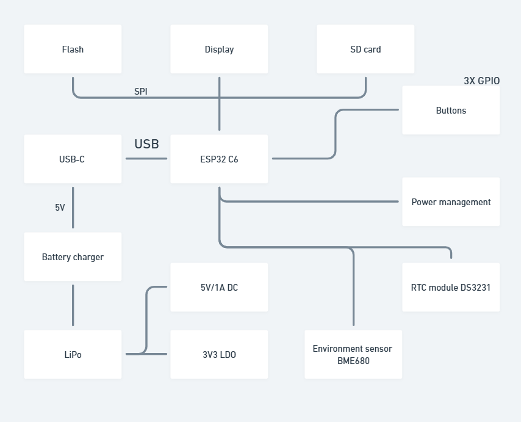

# Proiect_TSC

## 📊 Diagrama Block

---

##  Descriere Hardware

### 1. Microcontroller – ESP32-C6
- Nucleul sistemului, gestionează toate comunicațiile și logica aplicației.
- Arhitectură RISC-V 32-bit, 160 MHz
- Conectivitate: Wi-Fi 6 (2.4 GHz), Bluetooth 5.0
- GPIO: configurate pentru SPI, I2C, UART, control E-Ink

### 2. Power Management & Baterie
- Baterie Li-Po, 3.7V, 1800mAh
- Circuit de încărcare: MCP73831T
- Alimentare prin USB-C la 5V
- Protecție la supraîncărcare și descărcare profundă
- Regulator LDO 3.3V

### 3. Display – E-Ink 7.5"
- Dimensiune: 7.5 inch
- Rezoluție: 800x480 px
- Comunicare prin SPI

### 4. Port USB-C & Protecție ESD
- Alimentare și transfer de date
- Diodă Schottky și protecție ESD integrată

### 5. RTC – DS3231SN
- Păstrează ora exactă fără alimentare
- Comunicare prin I2C, include baterie de rezervă

### 6. Senzor Ambiental – BME688
- Măsoară temperatură, umiditate, presiune și calitatea aerului
- Comunicare I2C

### 7. Memorie externă – NOR Flash 64MB
- Conectată prin SPI
- Stocare extinsă pentru date și aplicații

### 8. Cititor SD Card
- Comunică prin SPI
- Permite stocare fișiere, jurnalizare și update firmware

### 9. Test Pads
- GPIO: control butoane și I/O general
- SPI: comunicare SD card, Flash și Display
- I2C: senzori și RTC
- UART: debug și serial
- Wi-Fi & Bluetooth: conectivitate wireless

---

##  Pin Mapping

| Componentă                     | Pini ESP32-C6                        | Interfață | Funcționalitate                                                            |
|-------------------------------|--------------------------------------|-----------|----------------------------------------------------------------------------|
| Butoane Control               | IO9 (BOOT), IO15 (CHANGE), EN (RESET) | GPIO      | Interacțiune utilizator                                                    |
| Conexiune USB-C               | GPIO prin regulator                  | USB       | Alimentare + programare ESP32                                              |
| Afișaj E-Paper                | IO7, IO6, IO10, IO5, IO23, IO3       | SPI       | Transfer date imagine + control                                           |
| Senzor BME688                 | IO21 (SDA), IO22 (SCL)               | I2C       | Măsurători ambientale                                                      |
| Modul RTC DS3231             | IO21 (SDA), IO22 (SCL), IO1, IO0, IO18 | I2C       | Timp real                                                                  |
| Flash NOR extern             | IO11 (CS), IO6, IO2, IO7             | SPI       | Memorie aplicație                                                          |
| Cititor MicroSD              | IO7, IO6, IO4, IO2                   | SPI       | Stocare fișiere externe                                                    |
| Monitorizare Baterie         | IO21 (SDA), IO22 (SCL)               | I2C       | Nivel încărcare                                                            |

---

##  Bill of Materials

| Componentă | Datasheet |  Distribuitor |
|------------|----------------------------|-------------------------------|
| CPH3225A | [Datasheet](https://www.snapeda.com/parts/CPH3225A/Seiko%20Instruments/datasheet/) | [Link](https://www.snapeda.com/parts/CPH3225A/Seiko+Instruments/view-part/?ref=eda) |
| TPTP20R | [Datasheet](https://cdn-shop.adafruit.com/product-files/3825/3825_diagram.PDF) | [Link](https://ro.mouser.com/ProductDetail/Adafruit/3825?qs=%252bEew9%252b0nqrAn6n76%252bB5vZg%3D%3D) |
| ESP32C6 Varistor 1812 | [Datasheet](https://www.snapeda.com/parts/RC0603JR-070RL/Yageo/datasheet/) | [Link](https://www.snapeda.com/parts/RC0603JR-070RL/Yageo/view-part/) |
| Capacitor 0402 | [Datasheet](https://componentsearchengine.com/Datasheets/2/CC0402MRX5R5BB106.pdf) | [Link](https://componentsearchengine.com/part-view/CC0402MRX5R5BB106/YAGEO) |
| USB4110-GF-A | [Datasheet](https://gct.co/files/drawings/usb4110.pdf) | [Link](https://componentsearchengine.com/part-view/USB4110-GF-A/GCT%20(GLOBAL%20CONNECTOR%20TECHNOLOGY)) |
| MBR0530 Schottky Diode | [Datasheet](https://www.snapeda.com/parts/MBR0530/ON%20Semiconductor/datasheet/) | [Link](https://www.snapeda.com/parts/MBR0530/Onsemi/view-part/?ref=eda) |
| PGB1010603MR | [Datasheet](https://www.snapeda.com/parts/PGB1010603MR/Littelfuse%20Inc./datasheet/) | [Link](https://www.snapeda.com/parts/PGB1010603MR/Littelfuse/view-part/?ref=eda) |
| MAX17048G+T10 | [Datasheet](https://www.snapeda.com/parts/MAX17048G+T10/Analog%20Devices/datasheet/) | [Link](https://www.snapeda.com/parts/MAX17048G+T10/Analog+Devices/view-part/?ref=eda) |
| QWIIC Connector | [Datasheet](https://www.snapeda.com/parts/PRT-14417/SparkFun%20Electronics/datasheet/) | [Link](https://www.snapeda.com/parts/PRT-14417/SparkFun/view-part/) |
| ESP32C6 WROOM-1-N8 | [Datasheet](https://www.snapeda.com/parts/ESP32-C6-WROOM-1-N8/Espressif%20Systems/datasheet/) | [Link](https://www.snapeda.com/parts/ESP32-C6-WROOM-1-N8/Espressif+Systems/view-part/?ref=eda) |
| RCL CPOL 3528 | [Datasheet](https://s3.amazonaws.com/snapeda/datasheet/TAJB475K025RNJ_AVX.pdf) | [Link](https://www.snapeda.com/parts/TAJB475K025RNJ/AVX/view-part/?ref=dk&t=capacitor%203528&con_ref=None) |
| 744043680 | [Datasheet](https://www.we-online.com/components/products/datasheet/744043680.pdf) | [Link](https://ro.mouser.com/ProductDetail/Wurth-Elektronik/744043680?qs=PGXP4M47uW6VkZq%252BkzjrHA%3D%3D) |
| SI1308EDL-T1-GE3 MOSFET | [Datasheet](https://www.snapeda.com/parts/SI1308EDL-T1-GE3/Vishay%20Siliconix/datasheet/) | [Link](https://www.snapeda.com/parts/SI1308EDL-T1-GE3/Vishay+Siliconix/view-part/?ref=eda) |
| DS3231SN | [Datasheet](https://www.snapeda.com/parts/DS3231SN%23/Analog%20Devices/datasheet/) | [Link](https://www.snapeda.com/parts/DS3231SN%23/Analog+Devices/view-part/?ref=eda) |
| W25Q512JVEIQ | [Datasheet](https://www.winbond.com/resource-files/W25Q512JV%20SPI%20RevB%2006252019%20KMS.pdf) | [Link](https://www.digikey.ro/en/models/10244706) |
| ESP32 WROVER MCP73831 Power Management | [Datasheet](https://www.snapeda.com/parts/MCP73831T-2ACI/OT/Microchip/datasheet/) | [Link](https://www.snapeda.com/parts/MCP73831T-2ACI/OT/Microchip/view-part/) |
| FH34SRJ-24S-0.5SH | [Datasheet](https://www.snapeda.com/parts/FH34SRJ-24S-0.5SH(99)/Hirose%20Connector/datasheet/) | [Link](https://www.snapeda.com/parts/FH34SRJ-24S-0.5SH(99)/Hirose/view-part/) |
| ESP32 WROVER BME680 Sensor | [Datasheet](https://www.bosch-sensortec.com/media/boschsensortec/downloads/datasheets/bst-bme680-ds001.pdf) | [Link](https://www.digikey.ro/en/models/7401317) |
| ESP32 WROVER 0805 Capacitor | [Datasheet](https://ro.mouser.com/datasheet/2/40/schottky-3165252.pdf) | [Link](https://ro.mouser.com/ProductDetail/KYOCERA-AVX/SD0805S020S1R0?qs=jCA%252BPfw4LHbpkAoSnwrdjw%3D%3D) |
| Custom Button | [Datasheet](https://industry.panasonic.com/global/en/downloads?tab=catalog&small_g_cd=203&part_no=EVQPUJ02K) | [Link](https://industry.panasonic.com/global/en/products/control/switch/light-touch/number/evqpuj02k) |
| 112A-TAAR-R03 | [Datasheet](https://www.snapeda.com/parts/112A-TAAR-R03/Attend/datasheet/) | [Link](https://www.snapeda.com/parts/112A-TAAR-R03/Attend/view-part/) |
| LED Chip 0603 | [Datasheet](https://www.snapeda.com/parts/KP-1608SURCK/Kingbright/datasheet/) | [Link](https://grabcad.com/library/0603-smd-led-1) |
| BD5229G-TR | [Datasheet](https://www.rohm.com/datasheet?p=BD5229G&dist=Digi-key&media=referral&source=digi-key.com&campaign=Digi-key) | [Link](https://www.digikey.ee/en/models/658502) |
| USBLC6-2SC6Y | [Datasheet](https://www.snapeda.com/parts/USBLC6-2SC6Y/STMicroelectronics/datasheet/) | [Link](https://www.snapeda.com/parts/USBLC6-2SC6Y/STMicroelectronics/view-part/?ref=eda) |
| XC6220A331MR-G | [Datasheet](https://product.torexsemi.com/system/files/series/xc6220.pdf) | [Link](https://componentsearchengine.com/part-view/XC6220A331MR-G/Torex) |
| Resistor 0402 | [Datasheet](https://www.yageo.com/upload/media/product/products/datasheet/rchip/PYu-RC_Group_51_RoHS_L_12.pdf) | [Link](https://componentsearchengine.com/part-view/R0402%201%25%20100%20K%20(RC0402FR-07100KL)/YAGEO) |

